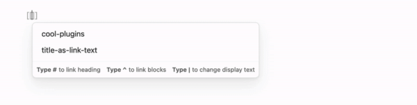

# Title As Link Text

[](https://github.com/lextoumbourou/obsidian-title-as-link-text/actions/workflows/test.yml)

> Transform your Obsidian links from plain filenames into meaningful titles automatically! 🔄



## ✨ What It Does

Title As Link Text is an [Obsidian](https://obsidian.md/) plugin that intelligently transforms your links to use note titles instead of filenames, whether you're using Markdown-style links or Wikilinks.

**Before:**

```markdown
[[20230408102501]]
[document-name](./complex-topic.md)
```

**After:**

```markdown
[[20230408102501|My Awesome Note]]
[Understanding Complex Topics](./complex-topic.md)
```

## ⚡ Key Features

- **Smart Title Detection**: Automatically finds the best title from frontmatter, H1 headers, or filenames
- **Multiple Link Styles**:

  - Wikilinks: `[[file-name|Note Title]]`
  - Markdown: `[Note Title](./file-name.md)`

- **Alias Support**: Respects your custom aliases with smart matching
- **Automatic Updates**: Links update automatically when you save or rename files

## ⚠️ WARNING

This plugin can modify multiple files when notes with backlinks are changed. **Please backup your vault before using.**

## 🚀 Installation

Title As Link Text is available as a Community Plugin.

1. Open **Settings** > **Community Plugins** > **Browse**
2. Search for **Title As Link Text**
3. Click **Install**

## 🔧 How It Works

### Title Inference Logic

1. **Frontmatter First**: Checks for a configured property in frontmatter (default: `title`)

  ```yaml
  ---
  title: My Note
  ---
  ```

2. **H1 Headers**: Falls back to first # heading

  ```markdown
  # My Note
  ```

3. **Filename Fallback**: Uses filename if no other title is found

### Smart Alias Matching

- **Substring Detection**: Matches partial aliases (e.g., "Project" → "My Project Name")
- **Fuzzy Matching**: Finds close matches when no exact match exists
- **Preserves Intentional Variations**: Respects your custom aliases

## 🤝 Recommended Companion Plugins

For Markdown-style users:

- [Wikilinks To Markdown](https://github.com/agathauy/wikilinks-to-mdlinks-obsidian): Convert existing Wikilinks
- [Front Matter Title](https://github.com/snezhig/obsidian-front-matter-title): Consistent title display

## ⚙️ Settings

- **Auto-update**: Automatically update links when notes are saved or renamed (enabled by default). When disabled, links will only update when you run the update commands manually.

### Title Source

- **Title from frontmatter**: Use the title field from frontmatter as the link text (enabled by default)
- **Frontmatter property**: The frontmatter property to use for getting the title (default: `title`). This allows you to use custom properties like `name`, `heading`, or any other field in your frontmatter.
- **Title from first heading**: Use the first heading in the note as the link text (enabled by default)
- **Use aliases**: Match link text against frontmatter aliases (enabled by default). When disabled, only the title will be used for link text, ignoring any aliases defined in frontmatter.

Both title source options can be toggled independently. When disabled, the plugin falls back to the next available source, ultimately defaulting to the filename.

### Advanced

- **Debounce delay**: How long to wait (in milliseconds) before updating links after a change (default: 1000ms)
- **Similarity threshold**: Minimum similarity score (0.0 to 1.0) required for alias matching. Higher values require closer matches (default: 0.65)
- **Reset to defaults**: Button to quickly reset all settings to their default values

## 🛠️ Commands

- `Update all links`: One-click update for all existing links in your vault
- `Update links for current file`: Update links only in the currently active note

## 👩‍💻 Development

Ensure you have [nvm](https://github.com/nvm-sh/nvm) (or some Node version manager).

Clone the repository and run the following to build the plugin:

```bash
nvm use 16
npm install
npm run build
```

Or to run dev server:

```bash
npm run dev
```

Run tests:

```bash
npm test
```

## 📄 License

MIT
